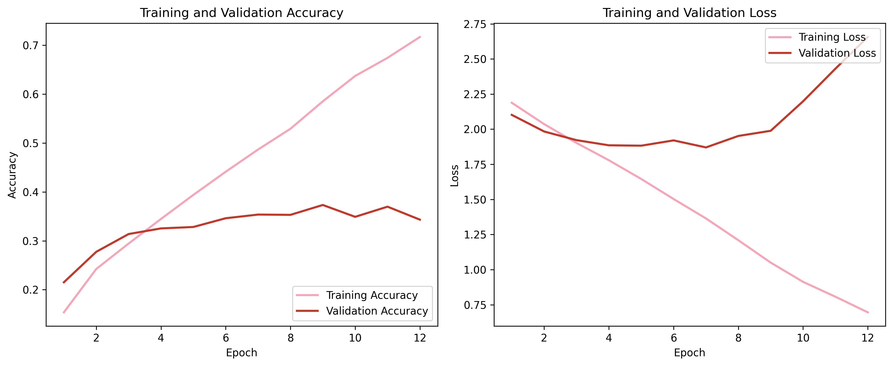

# WikiArt Art Movement Classification

A DL project that trains a convolutional neural network to classify paintings into art movement categories using the WikiArt dataset.

## Overview

Art movement classification is a challenging image recognition task. 
Unlike standard benchmarks where classes are visually distinct, art movements are defined by subtle stylistic properties such as brushwork, colour palette, and composition. 

This makes the task fundamentally different from object recognition, requiring the model to capture global and abstract visual patterns rather than discrete objects.

## Why this matters

Art movement classification has practical applications beyond academic interest:

- **Museum cataloguing:** assist curators in labelling large digital collections  
- **Art education:** provide interactive tools with top-k predictions and explanations  
- **Search & retrieval:** improve navigation in large visual archives  
- **Stylistic analysis:** support preliminary art historical investigation  

## Layout
This notebook is organized in the following manner:

1. Build a simple baseline CNN  
2. Increase capacity until the model overfits  
3. Apply regularisation to recover generalisation  
4. Use transfer learning for a substantial performance jump  
5. Fine-tune the pre-trained backbone on the target domain  

## Dataset

**Source:** [WikiArt Art Movements/Styles](https://www.kaggle.com/datasets/sivarazadi/wikiart-art-movementsstyles) via Kaggle

**10 selected art movements:**

| Movement | Approx. images |
|---|---|
| Romanticism | 6,800 |
| Renaissance | 6,200 |
| Realism | 5,400 |
| Baroque | 5,300 |
| Neoclassicism | 3,100 |
| Art_Nouveau | 3,000 |
| Expressionism | 2,600 |
| Japanese_Art | 2,200 |
| Rococo | 2,500 |
| Primitivism | 1,300 |

### Class distribution

### Sample paintings

## Methodology

### Data splits
- **70 / 15 / 15** stratified hold-out split
- Experiments use a stratified **30% subset** of training and validation for faster iteration
- The **test set uses the full 15%** and is evaluated exactly once at the end
- A **tuning subset of 300 images per class** is used for hyperparameter search only

### Preprocessing
- Scratch CNNs: images resized to **128×128**, pixel values normalised to [0, 1]
- Transfer learning: images resized to **160×160**, passed through MobileNetV2's own preprocessing
- Pipeline built with `tf.data.Dataset` with `.cache()` and `.prefetch()` for efficiency

### Training Strategy

| Model | Notes |
|---|---|
| Baseline CNN | 2 conv blocks, Flatten, no regularisation |
| Overfitting CNN | 3 deeper blocks, deliberately over-parameterised |
| Regularised CNN  | Dropout + L2, same architecture as overfit |
| Transfer (frozen) | MobileNetV2, frozen base, trained head |
| Fine-tuned  | Top 40% of MobileNetV2 unfrozen |

### Baseline

### Overfitting model

### Regularised model

### Transfer learning (frozen)

### Fine-tuning

## Key Findings
This project highlights the limitations of training CNNs from scratch on complex, high-level visual tasks and demonstrates the effectiveness of transfer learning.

- A simple CNN learns meaningful patterns (33% vs 10% random chance) but quickly saturates
- Increasing capacity leads to severe overfitting, confirming the dataset contains learnable signal but requires regularisation
- Regularisation alone was not sufficient to achieve strong generalisation in this setting
- Transfer learning produced a substantial improvement, showing that pre-trained features generalise well even to artistic domains
- Fine-tuning the upper layers of MobileNetV2 yielded the best performance, reaching ~59% test accuracy

These results suggest that for tasks defined by abstract visual properties, leveraging pre-trained representations is significantly more effective than learning from scratch.

**Most confused pairs:**

- Art Nouveau → Japanese Art (decorative style overlap)
- Baroque → Rococo (Rococo evolved directly from Baroque)
- Expressionism → Japanese Art (simplified, emotionally charged forms)

**Confident misclassifications**

