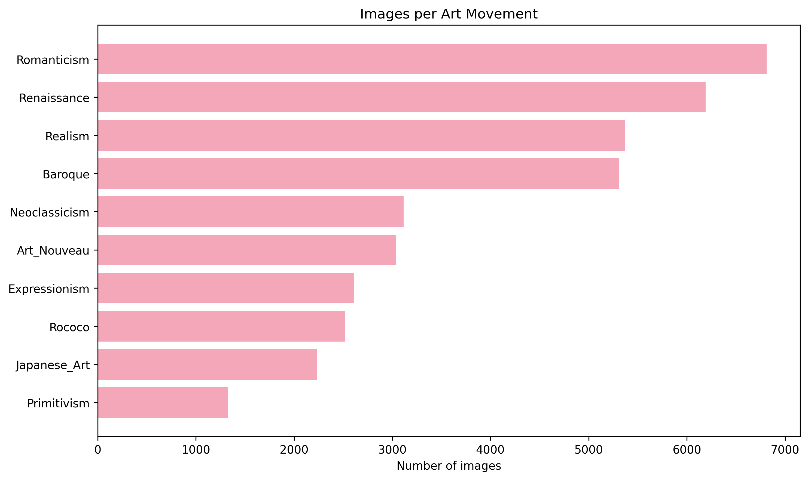
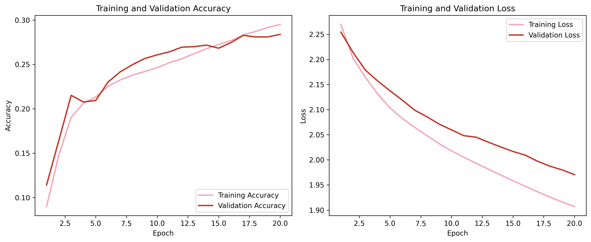
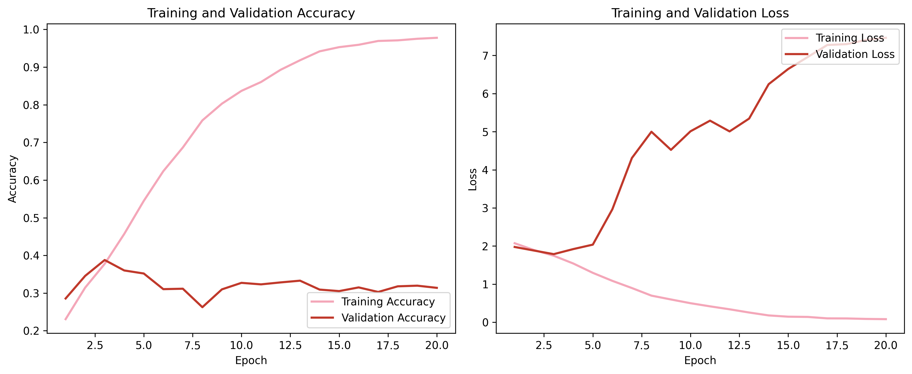
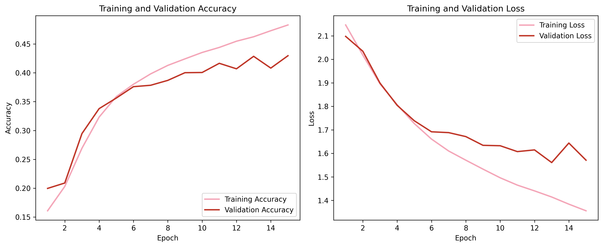
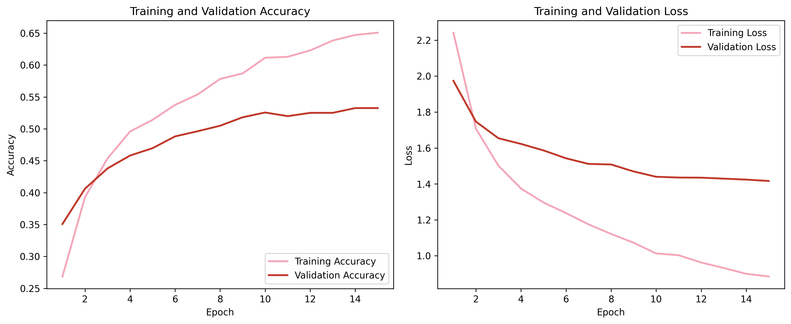
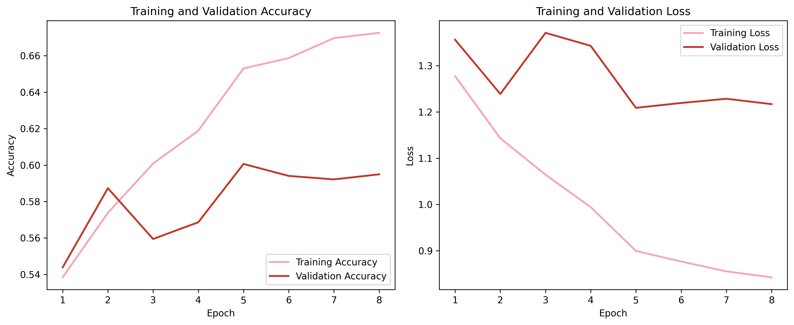
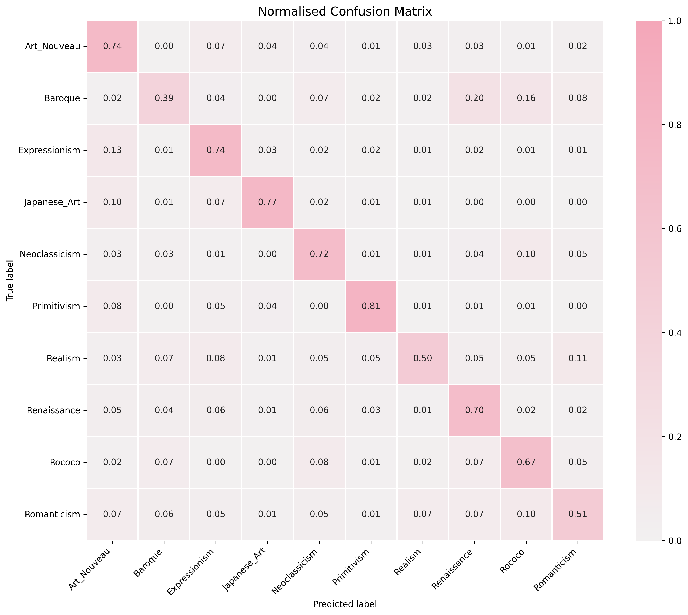
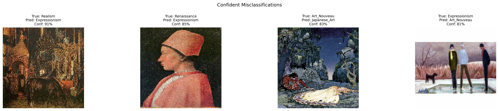

# WikiArt Art Movement Classification

A DL project that trains a convolutional neural network to classify paintings into art movement categories using the WikiArt dataset.

## Overview

Art movement classification is a challenging image recognition task. 
Unlike standard benchmarks where classes are visually distinct, art movements are defined by subtle stylistic properties such as brushwork, colour palette, and composition. 

This makes the task fundamentally different from object recognition, requiring the model to capture global and abstract visual patterns rather than discrete objects.

## Model Utility

Art movement classification has practical applications beyond academic interest:

- **Museum cataloguing:** assist curators in labelling large digital collections  
- **Art education:** provide interactive tools with top-k predictions and explanations  
- **Search & retrieval:** improve navigation in large visual archives  
- **Stylistic analysis:** support preliminary art historical investigation  

## Layout
This notebook is organized in the following manner:

1. Build a simple baseline CNN  
2. Increase capacity until the model overfits  
3. Apply regularisation to recover generalization and hyperparameter tuning
4. Use transfer learning for a substantial performance jump  
5. Fine-tune the pre-trained backbone on the target domain  

## Dataset

**Source:** [WikiArt Art Movements/Styles](https://www.kaggle.com/datasets/sivarazadi/wikiart-art-movementsstyles) via Kaggle

### Class distribution

### Sample paintings

## Methodology

### Data splits
- **70 / 15 / 15** stratified hold-out split
- Experiments use a stratified **30% subset** of training and validation for faster iteration
- The **test set uses the full 15%** and is evaluated exactly once at the end

### Preprocessing
- Scratch CNNs: images resized to **128×128**, pixel values normalised to [0, 1]
- Transfer learning: images resized to **160×160**, passed through MobileNetV2's own preprocessing
- Pipeline built with `tf.data.Dataset` with `.cache()` and `.prefetch()` for efficiency

### Training Strategy

| Model | Notes |
|---|---|
| Baseline CNN | Simple CNN with 2 convolutional blocks, Global Average Pooling (GAP), no regularization. It serves as the reference model. |
| Overfitting CNN | Larger model with 3 convolutional blocks (32, 64 and 128) and a Flatten layer to maximize parameters. |
| Regularised CNN  | Switches from Flatten to GAP and reduces the head to Dense(64). Adds Dropout after each convolutional block and dense layer, and L2 regularization (1e-6) on all convolutional layers. |
| Transfer (frozen) | MobileNetV2 pre-trained on ImageNet with base frozen and only the classification head trained. Resized to 160x160. |
| Fine-tuned  | Same as Transfer now with top 25% of MobileNetV2 layers unfrozen and fine-tuned to adapt the model to art movement features. |

## Model Results

### Baseline

### Overfitting model

### Regularised model

### Transfer learning (frozen)

### Fine-tuning

> **Note:** Baseline, Overfitting, and Transfer (frozen) were trained on a stratified 30% 
> subset. Regularised and Fine-tuned were additionally trained on the full dataset. 
> Therefore, results are not directly comparable across all models.

**Most confused pairs:**

- Art Nouveau for Japanese Art (decorative style overlap)
- Baroque for Rococo (Rococo evolved directly from Baroque)
- Expressionism for Japanese Art (simplified, emotionally charged forms)

**Confident misclassifications**

## Key Findings
This project highlights the limitations of training CNNs from scratch on complex, high-level visual tasks and demonstrates the effectiveness of transfer learning.

- A simple CNN learns meaningful patterns (33% vs 10% random chance) but quickly saturates
- Increasing capacity leads to severe overfitting, confirming the dataset contains learnable signal but requires regularization
- Regularization alone was not sufficient to achieve strong generalization in this setting
- Transfer learning produced a substantial improvement, showing that pre-trained features generalize well even to artistic domains
- Fine-tuning the upper layers of MobileNetV2 yielded the best performance, reaching ~59% test accuracy
- Precision-Recall analysis confirmed that Japanese Art and Primitivism are the most reliably predicted classes, while Realism and Baroque show steeper precision drops at higher recall levels.

These results suggest that for tasks defined by abstract visual properties, leveraging pre-trained representations is significantly more effective than learning from scratch.

## Future Work

**Train on all available movements.**  
This notebook focuses on 10 movements to keep class imbalance under control and make the experiments more stable.

**Hyperparameter Search**
A more exhaustive search using grid search or random search might help identify better configurations across multiple hyperparameters.

**Compare multiple pre-trained backbones.**  
Only MobileNetV2 was explored here and it would be valuable to compare it against other architectures such as EfficientNetB0.

**Explore more systematic fine-tuning strategies.**  
Future experiments could compare different unfreezing depths, keep BatchNorm layers frozen or use discriminative learning rates across layers.

**Move beyond single-label classification.**  
A more realistic setting would allow multi-label predictions, since many artworks lie at the intersection of multiple styles or transitional periods.

**Improve robustness to real-world inputs.**  
Future work could test robustness on photographs taken in museums, artworks under uneven lighting, cropped details, or lower-quality scans from the same categories, which would better reflect real deployment conditions and evaluate how the model performs on those compared to the curated dataset.

